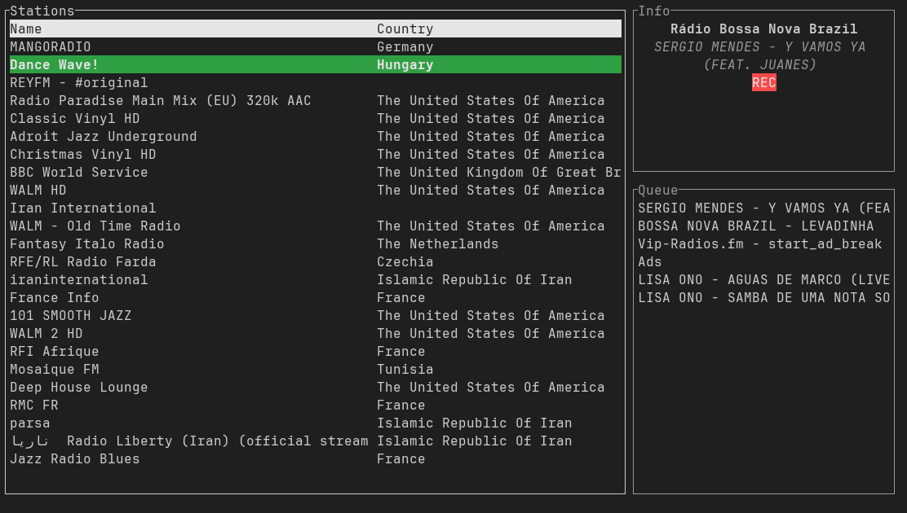

# amfm - Internet radio for the terminal

amfm is a TUI (Terminal User Interface) to browse, play, and save songs from various internet radio stations (The list of which is provided via [radio-browser.info](https://www.radio-browser.info/))

## Planned features
- [x] Initial user interface - Search stations
- [x] Playback
- [x] Save songs by name

## Build Requirements
Build requirements are defined in `Cargo.toml`. However, the following packages need to be installed as well:
* `pkg-config`
* `openssl`
* `gstreamer` and its various plugins (good, bad, ugly...)

## Usage
Run `amfm --help` to see all options and flags that can be used with the program.

## Special Thanks
Thank you very much to the [Shortwave](https://gitlab.gnome.org/World/Shortwave) developers as teh GStreamer backend code is taken from that app
